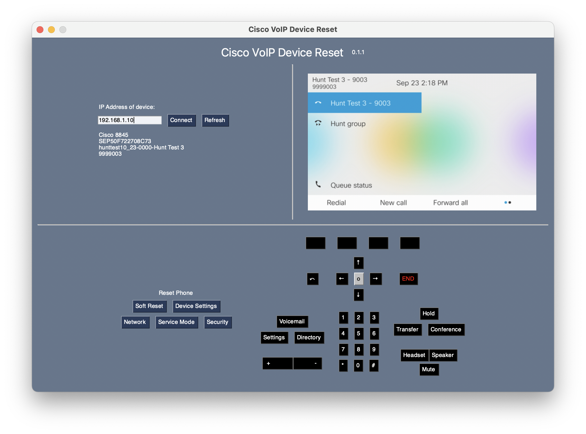

# Cisco VoIP Device Reset Tool



A simple GUI interface that allows you to connect to and remotely reset your Cisco IP phones.

> Note: At this time, only Cisco 8800 series phones are supported. There is planned support coming for Cisco 7800 models.

> **Important Note: This project is still in its early stages of development. Only a single server and a handful of devices have been tested so far.**

## Features

- Performs resets that could normally only be done in-person
- Automatically navigates device menus using `opencv` computer vision
- Fetches device screenshots at every step
- Press device keys as if you were physically at the phone
- Stores user credentials securely using OS's encrypted keyring

## Requirements

This tool makes use of Cisco's AXL API service. Before using this tool, please ensure that
- You have enabled "Cisco AXL Web Service" in CUCM Servicability
- Your administrator account has the role "Standard AXL API Access" 

For more details on getting AXL set up, please see [these instructions](https://github.com/PresidioCode/ciscoaxl#enable-axl-soap-service-on-cucm).

## Installation

Executables are available in the [releases](https://github.com/rlad78/cisco-voip-device-reset/releases) section for Windows, macOS (M1 and Intel), and ~~Linux~~ (coming soon). These are made using PyInstaller, so the app will take awhile to load.

If you would like to run the app from source, you will need:

- Python 3.9
- [Poetry](https://python-poetry.org/)

Clone or download the repository. In a terminal, navigate to the root folder of the repository. After installing Python 3.9 and Poetry, run the following:
```
poetry install --no-dev
poetry run gui
```
## Acknowledgements
Big thanks to [PresidioCode](https://github.com/PresidioCode) for developing and publishing the [ciscoaxl](https://github.com/PresidioCode/ciscoaxl) Python module. None of this would have been possible without the groundwork that they laid.